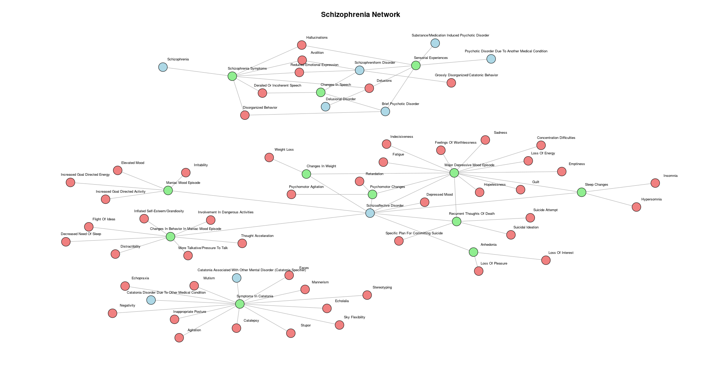
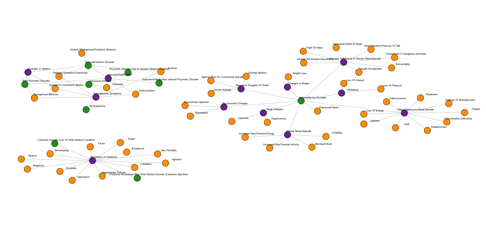
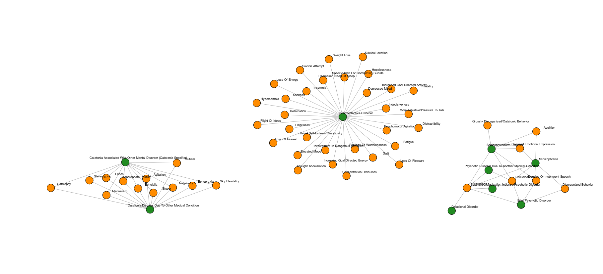

# O início

Foram umas duas semanas pra conseguir plotar o primeiro grafo, e mais umas duas pra fazer uma versão que fosse minimamente apresentável. Depois de tanto bater a cabeça na parede com coisas básicas porque eu não sabia nada de R (e achava que sabia pelo menos o básico), finalmente consegui fazer algo que me deixou satisfeito [i.e.: a professora resumiu tudo que eu tinha tentado fazer em 3 meses em 3 minutos digitando um código].

# O primeiro grafo
```{r, out.width = "90%", fig.align = "center", fig.cap="eita!", echo=FALSE}


```

# O primeiro grafo

```{r, out.width = "90%", fig.align = "center", fig.cap="cores", echo=FALSE}


```

# O primeiro grafo

```{r, out.width = "90%", fig.align = "center", fig.cap="experiência", echo=FALSE}

```

# Medidas de Centralidade

```{r, echo= FALSE, warning=FALSE, message=FALSE}
# library

library(igraph)
library(dplyr)
library(tidyr)
library(pheatmap)
library(knitr)
library(kableExtra)

`%ni%` <- Negate(`%in%`)

# df
schizophrenia_sympt <- read.csv2("/home/and/github/tryr/Precision_analytics/schizophrenia_symp.csv", header = TRUE)

# criando o grafo
interm = schizophrenia_sympt$Intermediate %>% unique
gTS = schizophrenia_sympt %>%
  select(Disorder, Symptom) %>%
  filter(Symptom %ni% interm) %>%
  graph_from_data_frame(directed = F) %>%  
  simplify(remove.multiple = TRUE, remove.loops = TRUE)
```

```{r, echo = FALSE}
centralidades <- data.frame(V(gTS)$name, 
                            degree = centr_degree(gTS, mode = "in", normalized = TRUE)$res, 
                            closeness = centr_clo(gTS, mode = "all", normalized = TRUE)$res, 
                            eigen = centr_eigen(gTS, directed = TRUE, normalized = TRUE)$vector, 
                            betweenness = centr_betw(gTS, directed = TRUE, normalized = TRUE)$res)

centralidades_sympt <- centralidades %>% 
  filter(centralidades$V.gTS..name %in% unique(schizophrenia_sympt$Symptom))
```

```{r, echo = FALSE, eval = TRUE}
centralidades_sympt%>%
head() %>%
kable(format = "latex", booktabs = TRUE) %>%
kable_styling(font_size = 7)
```

# Índice de Jaccard

```{r, echo = FALSE}
# jaccard index


transtorno_sintomas <- schizophrenia_sympt %>%
  select(Disorder, Symptom) %>%
  unique()


# Função para calcular o índice de Jaccard entre dois conjuntos
calcular_jaccard <- function(set1, set2) {
  intersecao <- length(intersect(set1, set2))
  uniao <- length(union(set1, set2))
  return(ifelse(uniao == 0, 0, intersecao / uniao))
}

transtornos <- unique(transtorno_sintomas$Disorder)
n <- length(transtornos)
transtornos[grep("Catatonia Associated", transtornos)] <- "Catatonia Associated with Another Mental Disorder"


matriz_jaccard <- matrix(0, nrow = n, ncol = n)
rownames(matriz_jaccard) <- transtornos
colnames(matriz_jaccard) <- transtornos

for (i in 1:n) {
  for (j in 1:n) {
    if (i != j) {
      sintomas_i <- transtorno_sintomas$Symptom[transtorno_sintomas$Disorder == transtornos[i]]
      sintomas_j <- transtorno_sintomas$Symptom[transtorno_sintomas$Disorder == transtornos[j]]
      matriz_jaccard[i, j] <- calcular_jaccard(sintomas_i, sintomas_j)
    }
  }
}


# heatmap jaccard 
diag(matriz_jaccard) <- 1

## gambiarra pra mostrar os números sem o -2 na diagonal
matriz_num_jac <- matriz_jaccard
matriz_num_jac <-round(matriz_num_jac, 3)
matriz_num_jac[matriz_num_jac == -2] <- ""
matriz_num_jac[matriz_num_jac == 0] <- ""
```

```{r, echo = FALSE, eval = TRUE, out.width = "80%", fig.align = "center"}
pheatmap(matriz_jaccard, 
         main = "Índice de Jaccard entre Transtornos",
         color = c("white",colorRampPalette(c("white", "red"))(100)),
         breaks = c(-1, seq(0, 1, length.out = 80)),
         angle_col = "45",
         cluster_cols = F,
         cluster_rows = F,
         legend_breaks = seq(0, 1, length.out = 3),
         legend_labels = c( "0","", "1"),
         #legend = F,
         display_numbers = matriz_num_jac,
         border_color = "grey80",
         fontsize = 8,
         fontsize_row = 7,
         fontsize_col = 7,
         cellwidth = 40,
         cellheight = 40
)
```

```{r, echo = FALSE}
# Separation transtornos

transtornos <- unique(transtorno_sintomas$Disorder)
matriz_distancia <- distances(gTS, v = transtornos, to = transtornos, mode = 'all')

matriz_distancia[is.infinite(matriz_distancia)] <- -1

max_dist <- max(matriz_distancia[matriz_distancia != -1])

matriz_numeros <- matriz_distancia

matriz_numeros[matriz_numeros == -1] <- ""
```

# Distância entre Transtornos

```{r, echo = FALSE, eval = TRUE, out.width = "80%", fig.align = "center"}
pheatmap(matriz_distancia, 
         main = "Distância entre Transtornos",
         color = cores <- c("white", colorRampPalette(c("grey", "red"))(100)),
         breaks = breaks <- c(-1.5, -0.5, seq(0, max_dist, length.out = 50)),
         angle_col = "45",
         cluster_cols = F,
         cluster_rows = F,
         display_numbers = matriz_numeros,
         legend = F,
         fontsize = 8,
         fontsize_row = 8,
         fontsize_col = 8,
         cellwidth = 30,
         cellheight = 30
         )
```

# Similiridade entre Transtornos
```{r, echo = FALSE}

calcular_proximidade <- function(transtorno1, transtorno2, grafo) {
  sintomas1 <- neighbors(grafo, transtorno1)
  sintomas2 <- neighbors(grafo, transtorno2)
  
  sintomas_compartilhados <- length(intersect(sintomas1, sintomas2))
  total_sintomas_unicos <- length(union(sintomas1, sintomas2))
  
  return(sintomas_compartilhados / total_sintomas_unicos)
}

# Criar matriz de proximidade
n <- length(transtornos)
matriz_proximidade <- matrix(0, nrow = n, ncol = n)
rownames(matriz_jaccard) <- transtornos
colnames(matriz_jaccard) <- transtornos

for (i in 1:n) {
  for (j in 1:n) {
    matriz_proximidade[i, j] <- calcular_proximidade(transtornos[i], transtornos[j], gTS)
  }
}
```

```{r, echo = FALSE, eval = TRUE, out.width = "80%", fig.align = "center"}

pheatmap(matriz_proximidade, 
         main = "Proximidade entre Transtornos (Sintomas Compartilhados)",
         color = colorRampPalette(c("white", "red"))(100),
         breaks = seq(0, 1, length.out = 100),
         angle_col = "45",
         cluster_cols = F,
         cluster_rows = F,
         display_numbers = T,
         legend = F,
         labels_row = transtornos,
         labels_col = transtornos,
         fontsize = 8,
         fontsize_row = 8,
         fontsize_col = 8,
         cellwidth = 30,
         cellheight = 30)
```


# Próximos passos

Os dados dos pacientes já estão disponíveis, e eu já estou lidando com eles (com 99% de ajuda da professora) e em breve os dois processos serão unificados. Ainda não sei como vou fazer isso, mas a ideia é usar os dados de sintomas e dos diagnósticos para tentar entender melhor a relação entre os transtornos.
E, finalmente, aplicar todos os resultados acima com todos os transtornos da base completa.

# Obrigado

\centering acredite nos seus sonhos!